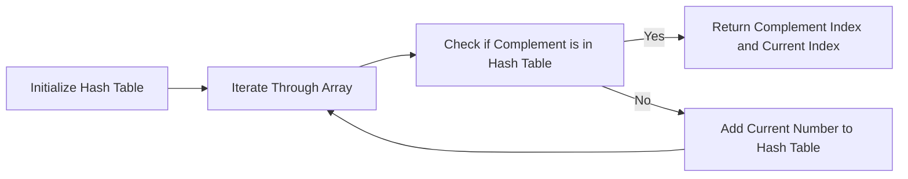

<h2><a href="https://leetcode.com/problems/two-sum">1. Two Sum</a></h2>

<p>Given an array of integers <code>nums</code>&nbsp;and an integer <code>target</code>, return <em>indices of the two numbers such that they add up to <code>target</code></em>.</p>

<p>You may assume that each input would have <strong><em>exactly</em> one solution</strong>, and you may not use the <em>same</em> element twice.</p>

<p>You can return the answer in any order.</p>

<p>&nbsp;</p>
<p><strong class="example">Example 1:</strong></p>

<pre><strong>Input:</strong> nums = [2,7,11,15], target = 9
<strong>Output:</strong> [0,1]
<strong>Explanation:</strong> Because nums[0] + nums[1] == 9, we return [0, 1].
</pre>

<p><strong class="example">Example 2:</strong></p>

<pre><strong>Input:</strong> nums = [3,2,4], target = 6
<strong>Output:</strong> [1,2]
</pre>

<p><strong class="example">Example 3:</strong></p>

<pre><strong>Input:</strong> nums = [3,3], target = 6
<strong>Output:</strong> [0,1]
</pre>

<p>&nbsp;</p>
<p><strong>Constraints:</strong></p>

<ul>
	<li><code>2 &lt;= nums.length &lt;= 10<sup>4</sup></code></li>
	<li><code>-10<sup>9</sup> &lt;= nums[i] &lt;= 10<sup>9</sup></code></li>
	<li><code>-10<sup>9</sup> &lt;= target &lt;= 10<sup>9</sup></code></li>
	<li><strong>Only one valid answer exists.</strong></li>
</ul>

<p>&nbsp;</p>
<strong>Follow-up:&nbsp;</strong>Can you come up with an algorithm that is less than <code>O(n<sup>2</sup>)</code><font face="monospace">&nbsp;</font>time complexity?

---

# 🛍️ Two-Sum | Explained

## Approach 1: Hash Table Approach
### Intuition
The intuition behind this approach is to use a hash table to store the numbers we have seen so far and their indices. This allows us to quickly look up the complement of a number (i.e., the number we need to add to it to get the target) and find its index. This approach works because it takes advantage of the constant-time lookup property of hash tables, allowing us to solve the problem in linear time.

### Algorithm Visualized


### Approach
The approach involves iterating through the array of numbers and for each number, checking if its complement (i.e., the number we need to add to it to get the target) is in the hash table. If it is, we return the index of the complement and the current index. If not, we add the current number to the hash table and continue with the next number.

### Detailed Code Analysis
The code starts by initializing a hash table `map` to store the numbers and their indices. The loop iterates through the array of numbers, and for each number, it calculates the complement `com` by subtracting the current number from the target. It then checks if the complement is in the hash table using the `containsKey` method. If it is, it returns an array containing the index of the complement (retrieved using the `get` method) and the current index `i`. If not, it adds the current number and its index to the hash table using the `put` method.

### Code
```java
class Solution {
    public int[] twoSum(int[] nums, int target) {
        HashMap<Integer,Integer> map=new HashMap<>();
        for(int i=0;i<nums.length;i++){
            int com=target-nums[i];
            if(map.containsKey(com)){
                return new int[]{map.get(com),i};
            }
            map.put(nums[i],i);
        }
        return new int[]{};
    }
}
```

### Complexity
- **Time:** The time complexity is O(n), where n is the length of the input array. This is because we are iterating through the array once and performing constant-time operations (hash table lookups and insertions) for each element.
- **Space:** The space complexity is O(n), where n is the length of the input array. This is because in the worst case, we need to store all elements of the input array in the hash table.

## 🕵️‍♂️ Follow-up Questions (Optional)
What if the input array is very large and doesn't fit into memory? 
- One possible solution is to use a disk-based hash table or a database to store the numbers and their indices. This would allow us to process the input array in chunks, storing the chunks in memory and using the disk-based hash table to store the numbers and their indices.
What if there are multiple pairs of numbers that add up to the target? 
- The current solution returns the first pair it finds. If we want to find all pairs, we can modify the solution to store all pairs it finds in a list and return the list at the end.