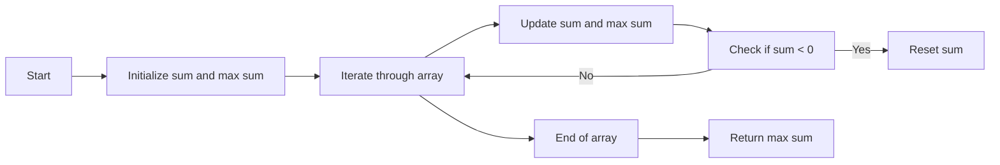

<h2><a href="https://leetcode.com/problems/maximum-subarray">53. Maximum Subarray</a></h2>

<p>Given an integer array <code>nums</code>, find the <span data-keyword="subarray-nonempty" class=" cursor-pointer relative text-dark-blue-s text-sm"><button type="button" aria-haspopup="dialog" aria-expanded="false" aria-controls="radix-_r_1l_" data-state="closed" class="">subarray</button></span> with the largest sum, and return <em>its sum</em>.</p>

<p>&nbsp;</p>
<p><strong class="example">Example 1:</strong></p>

<pre><strong>Input:</strong> nums = [-2,1,-3,4,-1,2,1,-5,4]
<strong>Output:</strong> 6
<strong>Explanation:</strong> The subarray [4,-1,2,1] has the largest sum 6.
</pre>

<p><strong class="example">Example 2:</strong></p>

<pre><strong>Input:</strong> nums = [1]
<strong>Output:</strong> 1
<strong>Explanation:</strong> The subarray [1] has the largest sum 1.
</pre>

<p><strong class="example">Example 3:</strong></p>

<pre><strong>Input:</strong> nums = [5,4,-1,7,8]
<strong>Output:</strong> 23
<strong>Explanation:</strong> The subarray [5,4,-1,7,8] has the largest sum 23.
</pre>

<p>&nbsp;</p>
<p><strong>Constraints:</strong></p>

<ul>
	<li><code>1 &lt;= nums.length &lt;= 10<sup>5</sup></code></li>
	<li><code>-10<sup>4</sup> &lt;= nums[i] &lt;= 10<sup>4</sup></code></li>
</ul>

<p>&nbsp;</p>
<p><strong>Follow up:</strong> If you have figured out the <code>O(n)</code> solution, try coding another solution using the <strong>divide and conquer</strong> approach, which is more subtle.</p>


---

# 🛍️ Maximum-Subarray | Explained

## Approach 1: Kadane's Algorithm
### Intuition
The core idea of Kadane's algorithm can be explained using a real-world analogy. Imagine you are on a journey where you can either start a new path or continue on the existing one. The goal is to find the path with the maximum total value. In the context of the Maximum Subarray problem, this path represents a subarray. Kadane's algorithm works by iterating through the array and at each step, deciding whether to start a new subarray or extend the existing one. This approach works because it ensures that all possible subarrays are considered, and the maximum sum is found by maintaining a running sum and updating the maximum sum whenever a higher sum is found.

### Algorithm Visualized


### Approach
The algorithm starts by initializing two variables: `sum` to keep track of the current subarray sum and `max1` to store the maximum sum found so far. It then iterates through the input array, adding each element to `sum` and updating `max1` if `sum` is greater. If `sum` becomes negative, it is reset to 0, effectively starting a new subarray. This process continues until the end of the array is reached, at which point `max1` holds the maximum subarray sum.

### Detailed Code Analysis
Let's dive into the code:
- Line 1-2: The class `Solution` is defined with a method `maxSubArray` that takes an integer array `nums` as input and returns the maximum subarray sum.
- Line 3: The length of the input array `nums` is stored in `n`.
- Line 4: `max1` is initialized to `Integer.MIN_VALUE`, ensuring that any sum will be greater than this initial value.
- Line 5: `sum` is initialized to 0, representing the sum of the current subarray.
- Line 6-10: The loop iterates through each element in the array. For each element:
  - Line 7: The current element `nums[i]` is added to `sum`.
  - Line 8: `max1` is updated to be the maximum of its current value and `sum`, ensuring that `max1` always holds the maximum sum found so far.
  - Line 9: If `sum` is less than 0, it is reset to 0. This is because a negative sum has no benefit in contributing to a maximum subarray sum, so it's better to start fresh.
- Line 11: After iterating through the entire array, `max1` is returned as the maximum subarray sum.

### Code
```java
class Solution {
    public int maxSubArray(int[] nums) {
        int n = nums.length;
        int max1 = Integer.MIN_VALUE;
        int sum = 0;
        for (int i = 0; i < n; i++) {
            sum += nums[i];
            max1 = Math.max(max1, sum);
            if (sum < 0) sum = 0;
        }
        return max1;
    }
}
```

### Complexity
- **Time:** O(n), where n is the number of elements in the input array. This is because the algorithm makes a single pass through the array.
- **Space:** O(1), indicating that the space required does not grow with the size of the input array, making it very efficient in terms of memory usage. The space is constant because only a fixed amount of space is used to store the variables `n`, `max1`, `sum`, and the loop counter `i`, regardless of the input size.

## 🕵️‍♂️ Follow-up Questions (Optional)
1. How does the algorithm handle an empty input array?
   - The algorithm does not explicitly handle an empty input array. However, if an empty array is passed, `n` would be 0, and the loop would not execute. The method would return `Integer.MIN_VALUE`, which might not be the expected behavior. To handle this, a simple check at the beginning of the method could return 0 for an empty array, as there's no maximum subarray sum in this case.
2. Can Kadane's algorithm be modified to find the maximum subarray sum for a 2D array?
   - Yes, Kadane's algorithm can be extended to find the maximum subarray sum in a 2D array. This involves applying the algorithm to each row and then considering subarrays that span multiple rows. A more efficient approach for 2D arrays might involve using a combination of Kadane's algorithm with row prefix sums to efficiently calculate sums of subarrays that span multiple rows.