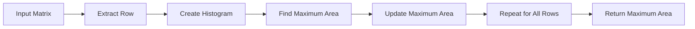

<h2><a href="https://leetcode.com/problems/maximal-rectangle">85. Maximal Rectangle</a></h2>

<p>Given a <code>rows x cols</code>&nbsp;binary <code>matrix</code> filled with <code>0</code>'s and <code>1</code>'s, find the largest rectangle containing only <code>1</code>'s and return <em>its area</em>.</p>

<p>&nbsp;</p>
<p><strong class="example">Example 1:</strong></p>

<pre><strong>Input:</strong> matrix = [["1","0","1","0","0"],["1","0","1","1","1"],["1","1","1","1","1"],["1","0","0","1","0"]]
<strong>Output:</strong> 6
<strong>Explanation:</strong> The maximal rectangle is shown in the above picture.
</pre>

<p><strong class="example">Example 2:</strong></p>

<pre><strong>Input:</strong> matrix = [["0"]]
<strong>Output:</strong> 0
</pre>

<p><strong class="example">Example 3:</strong></p>

<pre><strong>Input:</strong> matrix = [["1"]]
<strong>Output:</strong> 1
</pre>

<p>&nbsp;</p>
<p><strong>Constraints:</strong></p>

<ul>
	<li><code>rows == matrix.length</code></li>
	<li><code>cols == matrix[i].length</code></li>
	<li><code>1 &lt;= rows, cols &lt;= 200</code></li>
	<li><code>matrix[i][j]</code> is <code>'0'</code> or <code>'1'</code>.</li>
</ul>


---

# 🛍️ Maximal-Rectangle | Explained

## Approach 1: Histogram-Based Approach
### Intuition
The core idea behind this approach is to treat each row in the input matrix as the bottom of a histogram and then find the maximum rectangular area that can be formed. This works because a rectangular area in the matrix can be seen as a histogram where the height of each bar is the number of rows that the bar spans. By finding the maximum area in this histogram, we can determine the maximum rectangular area in the matrix.

### Algorithm Visualized


### Approach
The algorithm works by iterating over each row in the input matrix, creating a histogram for that row, and then finding the maximum rectangular area in that histogram. The histogram is created by incrementing the height of each bar for each row that the bar spans. The maximum area is then found by iterating over the histogram and calculating the area of each bar.

### Detailed Code Analysis
The code starts by checking if the input matrix is empty. If it is, the function returns 0 because there is no area to calculate.
```java
if(matrix.length==0){
    return 0;
}
```
Next, the code initializes an array `heights` to store the height of each bar in the histogram. The length of this array is equal to the number of columns in the input matrix.
```java
int cols=matrix[0].length;
int[] heights=new int[cols];
```
The code then iterates over each row in the input matrix.
```java
for(int i=0;i<matrix.length;i++){
    // ...
}
```
For each row, the code updates the `heights` array by incrementing the height of each bar if the current cell is '1' and resetting it to 0 if the current cell is '0'.
```java
for(int j=0;j<cols;j++){
    if(matrix[i][j]=='1'){
        heights[j]++;
    }
    else{
        heights[j]=0;
    }
}
```
After updating the `heights` array, the code calls the `largestRectangle` function to find the maximum rectangular area in the current histogram.
```java
maxArea=Math.max(maxArea,largestRectangle(heights));
```
The `largestRectangle` function uses a stack-based approach to find the maximum rectangular area in the histogram. The function iterates over the histogram and pushes the index of each bar onto the stack if the stack is empty or the current bar is higher than the bar at the top of the stack.
```java
for(int i=0;i<=n;i++){
    int currH=(i==n)? 0 : heights[i];
    while(!st.isEmpty() && currH < heights[st.peek()]){
        int height=heights[st.pop()];
        int width;
        if(st.isEmpty()){
            width=i;
        }
        else{
            width=i-st.peek()-1;
        }
        maxArea=Math.max(maxArea,height*width);
    }
    st.push(i);
}
```
If the current bar is lower than the bar at the top of the stack, the function pops the top of the stack and calculates the area of the bar that was popped. The width of the bar is calculated based on the current index and the index of the bar at the top of the stack.

### Code
```java
public int maximalRectangle(char[][] matrix) {
    if(matrix.length==0){
        return 0;
    }
    int cols=matrix[0].length;
    int[] heights=new int[cols];
    int maxArea=0;

    for(int i=0;i<matrix.length;i++){
        for(int j=0;j<cols;j++){
            if(matrix[i][j]=='1'){
                heights[j]++;
            }
            else{
                heights[j]=0;
            }
        }
        maxArea=Math.max(maxArea,largestRectangle(heights));
    }
    return maxArea;
}

private int largestRectangle(int[] heights){
    int n=heights.length;
    Stack<Integer> st=new Stack<>();
    int maxArea=0;

    for(int i=0;i<=n;i++){
        int currH=(i==n)? 0 : heights[i];
        while(!st.isEmpty() && currH < heights[st.peek()]){
            int height=heights[st.pop()];
            int width;
            if(st.isEmpty()){
                width=i;
            }
            else{
                width=i-st.peek()-1;
            }
            maxArea=Math.max(maxArea,height*width);
        }
        st.push(i);
    }
    return maxArea;
}
```

### Complexity
- **Time:** O(m*n) where m is the number of rows in the input matrix and n is the number of columns. This is because the algorithm iterates over each cell in the input matrix once.
- **Space:** O(n) where n is the number of columns in the input matrix. This is because the algorithm uses an array of size n to store the heights of the bars in the histogram.

## 🕵️‍♂️ Follow-up Questions (Optional)
Some common follow-up questions for this problem include:
- How would you optimize the algorithm for very large input matrices?
- How would you modify the algorithm to find the maximum rectangular area in a binary image?
Answer: You could optimize the algorithm by using a more efficient data structure, such as a priority queue, to store the heights of the bars in the histogram. You could also modify the algorithm to find the maximum rectangular area in a binary image by treating the image as a 2D array and applying the same algorithm.