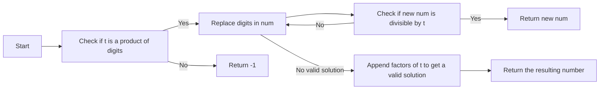

<h2><a href="https://leetcode.com/problems/smallest-divisible-digit-product-ii">3348. Smallest Divisible Digit Product II</a></h2>

<p>You are given a string <code>num</code> which represents a <strong>positive</strong> integer, and an integer <code>t</code>.</p>

<p>A number is called <strong>zero-free</strong> if <em>none</em> of its digits are 0.</p>

<p>Return a string representing the <strong>smallest</strong> <strong>zero-free</strong> number greater than or equal to <code>num</code> such that the <strong>product of its digits</strong> is divisible by <code>t</code>. If no such number exists, return <code>"-1"</code>.</p>

<p>&nbsp;</p>
<p><strong class="example">Example 1:</strong></p>

<div class="example-block">
<p><strong>Input:</strong> <span class="example-io">num = "1234", t = 256</span></p>

<p><strong>Output:</strong> <span class="example-io">"1488"</span></p>

<p><strong>Explanation:</strong></p>

<p>The smallest zero-free number that is greater than 1234 and has the product of its digits divisible by 256 is 1488, with the product of its digits equal to 256.</p>
</div>

<p><strong class="example">Example 2:</strong></p>

<div class="example-block">
<p><strong>Input:</strong> <span class="example-io">num = "12355", t = 50</span></p>

<p><strong>Output:</strong> <span class="example-io">"12355"</span></p>

<p><strong>Explanation:</strong></p>

<p>12355 is already zero-free and has the product of its digits divisible by 50, with the product of its digits equal to 150.</p>
</div>

<p><strong class="example">Example 3:</strong></p>

<div class="example-block">
<p><strong>Input:</strong> <span class="example-io">num = "11111", t = 26</span></p>

<p><strong>Output:</strong> <span class="example-io">"-1"</span></p>

<p><strong>Explanation:</strong></p>

<p>No number greater than 11111 has the product of its digits divisible by 26.</p>
</div>

<p>&nbsp;</p>
<p><strong>Constraints:</strong></p>

<ul>
	<li><code>2 &lt;= num.length &lt;= 2 * 10<sup>5</sup></code></li>
	<li><code>num</code> consists only of digits in the range <code>['0', '9']</code>.</li>
	<li><code>num</code> does not contain leading zeros.</li>
	<li><code>1 &lt;= t &lt;= 10<sup>14</sup></code></li>
</ul>


---

# 🛍️ Smallest-Divisible-Digit-Product-II | Explained

## Approach 1: Iterative GCD and Digit Replacement
### Intuition
This approach works by first checking if the given number `t` can be expressed as a product of digits from 2 to 9. It then attempts to replace digits in the input number `num` to find the smallest number that can be divisible by `t`. The core idea is to iteratively replace digits in `num` with smaller digits while ensuring the resulting number remains divisible by `t`. This process continues until a valid solution is found or it is determined that no such solution exists.

### Algorithm Visualized


### Approach
1. First, check if `t` is a product of digits from 2 to 9 by dividing `t` by each digit from 2 to 9 as long as it is divisible.
2. If `t` is a product of digits, then attempt to replace digits in `num` with smaller digits while ensuring the resulting number remains divisible by `t`.
3. Start from the leftmost non-zero digit in `num` and replace it with the next larger digit if possible.
4. After replacing a digit, check if the remaining digits can still be made to divide `t` by iteratively dividing the remaining value of `t` by the digits from 2 to 9.
5. If a valid solution is found, return the resulting number.
6. If no valid solution is found, append the factors of `t` to `num` to get a valid solution.

### Detailed Code Analysis
The code starts by defining a helper function `gcd` to calculate the greatest common divisor of two numbers using the Euclidean algorithm.

```java
private long gcd(long a, long b) {
    while (b != 0) {
        long temp = a % b;
        a = b;
        b = temp;
    }
    return a;
}
```

The main function `smallestNumber` first checks if `t` is a product of digits from 2 to 9.

```java
long temp = t;
for (int digit = 2; digit <= 9; digit++) {
    while (temp % digit == 0) {
        temp /= digit;
    }
}
if (temp != 1) {
    return "-1";
}
```

If `t` is a product of digits, the function then attempts to replace digits in `num` with smaller digits while ensuring the resulting number remains divisible by `t`.

```java
int n = num.length();
char[] digits = num.toCharArray();
long[] remaining = new long[n + 1];
remaining[0] = t;

int lastValidPos = n - 1;

for (int i = 0; i < n; i++) {
    int digit = digits[i] - '0';

    if (digit == 0) {
        lastValidPos = i;
        break;
    }

    long common = gcd(remaining[i], digit);
    remaining[i + 1] = remaining[i] / common;
}
```

If a valid solution is found, the function returns the resulting number.

```java
if (remaining[n] == 1) {
    return num;
}
```

If no valid solution is found, the function appends the factors of `t` to `num` to get a valid solution.

```java
StringBuilder factors = new StringBuilder();
long remainingT = t;

for (int digit = 9; digit >= 2; digit--) {
    while (remainingT % digit == 0) {
        factors.append(digit);
        remainingT /= digit;
    }
}

int requiredLength = Math.max(n + 1, factors.length());

while (factors.length() < requiredLength) {
    factors.append('1');
}

return factors.reverse().toString();
```

### Code
```java
class Solution {
    private long gcd(long a, long b) {
        while (b != 0) {
            long temp = a % b;
            a = b;
            b = temp;
        }
        return a;
    }

    public String smallestNumber(String num, long t) {
        long temp = t;

        for (int digit = 2; digit <= 9; digit++) {
            while (temp % digit == 0) {
                temp /= digit;
            }
        }

        if (temp != 1) {
            return "-1";
        }

        int n = num.length();
        char[] digits = num.toCharArray();
        long[] remaining = new long[n + 1];
        remaining[0] = t;

        int lastValidPos = n - 1;

        for (int i = 0; i < n; i++) {
            int digit = digits[i] - '0';

            if (digit == 0) {
                lastValidPos = i;
                break;
            }

            long common = gcd(remaining[i], digit);
            remaining[i + 1] = remaining[i] / common;
        }

        if (remaining[n] == 1) {
            return num;
        }

        for (int i = lastValidPos; i >= 0; i--) {
            int currentDigit = digits[i] - '0';

            for (int newDigit = currentDigit + 1; newDigit <= 9; newDigit++) {
                digits[i] = (char) ('0' + newDigit);

                long need = remaining[i];
                need /= gcd(need, newDigit);

                char[] suffix = new char[n - i - 1];
                int suffixSize = 0;

                for (int j = i + 1; j < n; j++) {
                    int chosenDigit = 9;

                    while (chosenDigit > 1 && need % chosenDigit != 0) {
                        chosenDigit--;
                    }

                    if (need % chosenDigit == 0) {
                        need /= chosenDigit;
                    }

                    suffix[suffixSize++] = (char) ('0' + chosenDigit);
                }

                if (need == 1) {
                    for (int a = 0, b = suffixSize - 1; a < b; a++, b--) {
                        char tmp = suffix[a];
                        suffix[a] = suffix[b];
                        suffix[b] = tmp;
                    }

                    for (int j = i + 1; j < n; j++) {
                        digits[j] = suffix[j - i - 1];
                    }

                    return new String(digits);
                }
            }

            digits[i] = num.charAt(i);
        }

        StringBuilder factors = new StringBuilder();
        long remainingT = t;

        for (int digit = 9; digit >= 2; digit--) {
            while (remainingT % digit == 0) {
                factors.append(digit);
                remainingT /= digit;
            }
        }

        int requiredLength = Math.max(n + 1, factors.length());

        while (factors.length() < requiredLength) {
            factors.append('1');
        }

        return factors.reverse().toString();
    }
}
```

### Complexity
- **Time:** O(n \* 10 \* n) = O(n^2) where n is the length of the input string `num`. This is because we have two nested loops, each of which iterates up to n times, and inside the inner loop, we have another loop that iterates up to 10 times (for the digits from 2 to 9).
- **Space:** O(n) where n is the length of the input string `num`. This is because we use two arrays of length n+1 to store the remaining values and the suffix. We also use a StringBuilder to store the factors of `t`, which can have a maximum length of n+1.