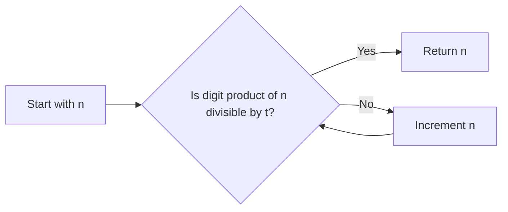

<h2><a href="https://leetcode.com/problems/smallest-divisible-digit-product-i">3345. Smallest Divisible Digit Product I</a></h2>

<p>You are given two integers <code>n</code> and <code>t</code>. Return the <strong>smallest</strong> number greater than or equal to <code>n</code> such that the <strong>product of its digits</strong> is divisible by <code>t</code>.</p>

<p>&nbsp;</p>
<p><strong class="example">Example 1:</strong></p>

<div class="example-block">
<p><strong>Input:</strong> <span class="example-io">n = 10, t = 2</span></p>

<p><strong>Output:</strong> <span class="example-io">10</span></p>

<p><strong>Explanation:</strong></p>

<p>The digit product of 10 is 0, which is divisible by 2, making it the smallest number greater than or equal to 10 that satisfies the condition.</p>
</div>

<p><strong class="example">Example 2:</strong></p>

<div class="example-block">
<p><strong>Input:</strong> <span class="example-io">n = 15, t = 3</span></p>

<p><strong>Output:</strong> <span class="example-io">16</span></p>

<p><strong>Explanation:</strong></p>

<p>The digit product of 16 is 6, which is divisible by 3, making it the smallest number greater than or equal to 15 that satisfies the condition.</p>
</div>

<p>&nbsp;</p>
<p><strong>Constraints:</strong></p>

<ul>
	<li><code>1 &lt;= n &lt;= 100</code></li>
	<li><code>1 &lt;= t &lt;= 10</code></li>
</ul>


---

# 🛍️ Smallest-Divisible-Digit-Product-I | Explained
## Approach 1: Incremental Number Checking
### Intuition
The core idea behind this approach is to continuously check each number, starting from the given input `n`, to see if the product of its digits is divisible by `t`. This process is repeated incrementally until such a number is found. The approach works because it systematically explores all possible numbers in ascending order, ensuring that the smallest number that meets the condition will be discovered first.

### Algorithm Visualized


### Approach
The algorithm starts with the input number `n` and checks if the product of its digits is divisible by `t`. If it is, the algorithm returns `n` as the result. If not, it increments `n` by 1 and repeats the check. This process continues indefinitely until a number is found whose digit product is divisible by `t`.

### Detailed Code Analysis
The solution starts with a `while` loop that runs indefinitely (`while(true)`). Inside the loop, it calculates the product of the digits of the current number `n` using the `digitProduct` method and stores the result in `res`. It then checks if `res` is divisible by `t` using the modulo operator (`res % t == 0`). If `res` is divisible by `t`, the method returns `n`. Otherwise, it increments `n` by 1 and repeats the loop.

The `digitProduct` method takes an integer `num` as input and calculates the product of its digits. It initializes a variable `product` to 1 and then enters a loop where it extracts the last digit of `num` using `num % 10`, multiplies `product` by this digit, and removes the last digit from `num` using `num /= 10`. This process repeats until all digits have been processed (i.e., `num` becomes 0), at which point the method returns the calculated product.

### Code
```java
class Solution {
    public int smallestNumber(int n, int t) {
        while(true){
            int res = digitProduct(n);
            if(res % t == 0) return n;
            else n++;
        }
    }
    private int digitProduct(int num){
        int product = 1;
        while(num > 0){
            int t1 = num % 10;
            product *= t1;
            num /= 10;
        }
        return product;
    }
}
```

### Complexity
- **Time:** The time complexity of this solution is O(k \* m), where k is the number of numbers that need to be checked before finding a number whose digit product is divisible by `t`, and m is the average number of digits in these numbers. The reason is that for each number, we are calculating the product of its digits, which takes O(m) time. In the worst-case scenario, k could be very large if `t` is a large prime number and `n` is small.
- **Space:** The space complexity is O(1), meaning the space required does not change with the size of the input, making it constant. This is because we are only using a fixed amount of space to store our variables (`n`, `t`, `res`, `product`, `num`, and `t1`), regardless of the input size.

## 🕵️‍♂️ Follow-up Questions (Optional)
1. **Q:** How would you optimize the solution if `t` is very large and `n` is relatively small?
   **A:** One potential optimization could involve using a more efficient algorithm for calculating the product of digits or exploring mathematical properties that could help skip unnecessary checks. However, given the simplicity and directness of the current approach, significant optimizations might require a fundamentally different strategy.
2. **Q:** What if the input `n` can be very large? Would the current approach still be feasible?
   **A:** If `n` can be very large, the current approach might become impractical due to its incremental nature and the potential for an extremely long running time. In such cases, exploring mathematical patterns or properties related to divisibility and digit products could lead to a more efficient solution.